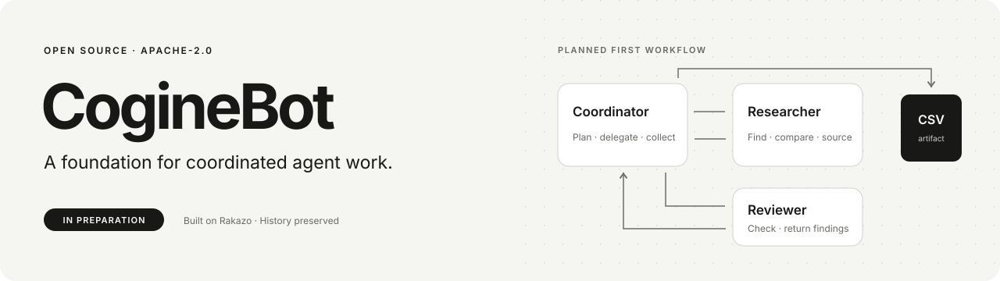

<p align="center">
  
</p>

# CogineBot

**让 Agent 协作，把交付成果看清楚。**

[English](README.md) · **简体中文**

[开始使用](#开始使用) · [开发指南](docs/development.md) · [参与贡献](CONTRIBUTING.md) · [验证基线](docs/preparation-baseline.md) · [仓库自动化](docs/automation.md) · [Apache-2.0](LICENSE)

CogineBot 是由 [cogine-ai](https://github.com/cogine-ai) 维护、基于 [Rakazo](https://github.com/elie222/rakazo) 的开源 Agent 工作台。我们正在开发一个聚焦的网页流程：提交要求，协作研究与审查，在执行中修改要求，最后下载成果。

**处于早期开发阶段。** 本仓库尚未通过完整 Coordinator → Researcher → Reviewer → CSV 流程及中途修改要求的真实模型验收。目前没有 CogineBot 托管服务、发布镜像或安装器。

## 仓库里有什么

| 从固定 Rakazo 基线继承的能力 | CogineBot 首个流程的计划 |
| --- | --- |
| 持久 Bot、Space、对话、记忆与例行任务 | 三个固定角色完成一个可复现的方案检索与比较任务 |
| Bot 间委派和异步结果消息 | 必需研究、审查和有效结果文件共同决定任务完成 |
| 文件工具、产物预览和下载路径 | 附来源及审查结论的可下载 CSV |
| 网页、Electron、Expo 客户端共用 API | 优先完善网页首用与可见进度 |
| 模型连接，以及可选的电脑和集成适配器 | 要求版本、过时结果拒绝、取消和费用边界 |

左栏描述保留源码中的能力，验证范围随配置不同；右栏是待验收计划。现有 `@rakazo/*` 包名和应用界面仍沿用上游。

[改造前验证基线](docs/preparation-baseline.md) 记录了类型检查、网页构建、选定 PostgreSQL 与浏览器检查，以及默认离线单元测试。该单元测试结果为 **7,456 通过、2 失败、231 跳过**。两个启动器失败仍有记录；scripted/fake 提供方检查不能证明真实模型任务质量或真实电脑恢复能力。

## 开始使用

使用 Node.js 24 和 pnpm 9.15.0；准确的 Node 支持范围见 [package.json](package.json)。

```sh
git clone https://github.com/cogine-ai/CogineBot.git
cd CogineBot
node scripts/check-repository.mjs
```

第一步只检查仓库文档与自动化元数据，不需要安装依赖、数据库、模型 Key 或应用秘密。

验证源码时，从干净 checkout 开始，shell 中不保留提供方凭据或 `VERIFY_*` 显式启用项：

```sh
corepack pnpm install --frozen-lockfile --ignore-scripts
corepack pnpm db:generate
corepack pnpm check
corepack pnpm lint
NODE_ENV=test corepack pnpm test --maxWorkers=2
```

安装依赖需要访问包源；这些检查不需要付费推理。生成 Prisma client 不需要正在运行的数据库。已记录的 macOS 基线包含上述两个启动器失败，请回报实际结果，不预设整套测试通过。

前置条件、本地 UI/API、验证层次和排错方式见[开发指南](docs/development.md)。本项目从源码开发；保留的上游指南中的链接和镜像渠道对应 Rakazo 资源。

## 导航与项目结构

```text
apps/       网页、API、worker、Electron、Expo 和官网
packages/   合同、领域逻辑、持久化、适配器、UI、测试工具
infra/      本地服务、电脑镜像和 supervisor
scripts/    开发与仓库检查
docs/       开发、验证、运行及来源记录
```

| 想了解 | 阅读 |
| --- | --- |
| 配置开发环境并选择检查 | [开发指南](docs/development.md) |
| 哪些能力实际测过 | [改造前验证基线](docs/preparation-baseline.md) |
| 模拟执行与模型质量的区别 | [Agent 验证](docs/agent-verification.md) |
| 仓库 CI 与归档工作流 | [自动化说明](docs/automation.md) |
| 上游起点及同步策略 | [上游来源记录](UPSTREAM.md) |
| 提交修改或报告安全问题 | [贡献指南](CONTRIBUTING.md) · [安全说明](SECURITY.md) |

## 路线图

1. **仓库质量：** 清楚的源码入门、双语入口、贡献说明和只读 CI。
2. **真实模型基线：** 在合成数据和明确预算下，验收三角色 CSV 流程。
3. **任务行为：** 验收要求版本、审查与产物绑定、过时结果拒绝、失败和取消。
4. **发布准备：** 验证隔离、相关电脑恢复、费用、干净安装及实际分发内容。

这些是推进顺序，不是交付日期。可查看 [Issues](https://github.com/cogine-ai/CogineBot/issues) 和[仓库 CI](https://github.com/cogine-ai/CogineBot/actions/workflows/repository-ci.yml) 中对应提交的结果。本轮质量分支的检查与已记录的改造前基线分别报告。

## 许可证与致谢

CogineBot 保留 Rakazo 从 [`794a76da6eb0a73532a89cf57d2f202ef9b6b6c8`](https://github.com/elie222/rakazo/commit/794a76da6eb0a73532a89cf57d2f202ef9b6b6c8) 开始的历史、[Apache-2.0 许可全文](LICENSE) 及原有版权和归属声明。已识别拷入组件的附加条款见 [THIRD_PARTY_NOTICES.md](THIRD_PARTY_NOTICES.md)；该文件不是完整依赖或素材清单。

这是独立维护的派生项目。项目关系与更新政策见 [UPSTREAM.md](UPSTREAM.md)。原始 [README.upstream.md](README.upstream.md) 原样保留供参考。

本中文入口于 2026-10-09 新增，对应英文项目介绍与源码开发说明；上游原文另行保留。
